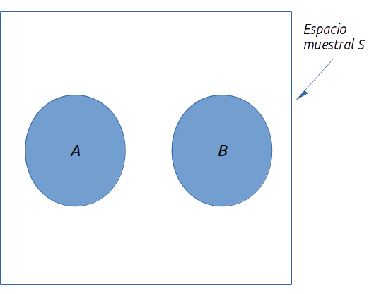

La probabilidad es una medida numérica de la posibilidad de que ocurra un evento. Por tanto, las probabilidades son una medida del grado de incertidumbre asociado con cada uno de los eventos previamente enunciados. Si cuenta con las probabilidades, tiene la capacidad de determinar la posibilidad de ocurrencia que tiene cada evento. La probabilidad sempre se expresa en término decimales o porcentajes, siendo 0 el valor de probabilidad de algo improbable y 1 (o 100%) el de algo seguro.

## Experimentos, reglas de conteo y asignación de probabilidades
Un __experimento__ es un proceso que arroja resultados definidos y en cada una de las ocasiones que se lleve a cabo generará solo uno de todos los posibles resultados. Podemos definir como experimentos:

__Arrojar una moneda__, cuyos posibles resultados son _águila_ o _sello_.
__Inspeccionar una pieza__, con defecto o sin defecto.
__Realizar una llamada de ventas__, se consigue la compra o no.
__Jugar un partido de futbol__, se gana, se empata o se pierde.

Todos los posibles resultados de un experimento se definen como el __campo muestral__ del mismo. Mientras que a cada posible resultado se le conoce como __punto muestra__. El espacio muestral se denota por la letra $S$ y por tanto, se puede utilizar la siguiente notación para describirlo en función de los posibles resultados $x_i$:

$$
S=\{x_1, x_2, x_3,...x_n\}
$$

Si por ejemplo, tomamos el caso de una moneda, podremos describirlo así:

$$
S_{moneda}=\{águila, sello \}
$$

O en el caso de un dado:

$$
S_{dado}=\{1,2,3,4,5,6\}
$$

### Reglas de conteo

Veamos cómo se identifican y cuentan los resultados experimentales. Existen tres reglas de conteo que son muy utilizadas.

#### Experimentos de pasos múltiples
Considere un experimento que consiste en lanzar dos monedas. ¿Cuántos posibles resultados tiene este experimento? Tomemos en cuenta que primero se lanza una moneda y enseguida la otra. Si denotamos _águila_ con $A$ y _sello_ con $B$, entonces los posibles resultados son:

$$
S_{monedas}=\{(A,A),(A,B),(B,A),(B,B) \}
$$

> Un experimento se describe como una sucesión de $k$ pasos en los que hay $n_1$ resultados posibles en el primer paso, $n_2$ resultados posibles en el segundo y así sucesivamente. Por lo tanto, el número total de resultados experimentales es $(n_1)(n_2)...(n_k)$.

Si retomamos el caso anterior, lanzar la primera moneda implica $(n_1=2)$ y la segunda $(n_2=2)$, siguiendo la regla de conteo $(2)(2)=4$, así que tenemos cuatro posibles resultados. Ahora bien, si por ejemplo lanzamos tres monedas, tendremos $(2)(2)(2)=8$ resultados experimentales. 

Un diagrama que puede apoyar en la elaboración de reglas de conteo es el __diagrama de árbol__, el cual se muestra a continuación para el problema del lanzamiento de dos monedas. 

```{r echo=FALSE}
library(DiagrammeR)
```

```{r echo=FALSE}
grViz("
digraph dot {

graph [layout = dot, rankdir = LR]

node [shape = circle,
      style = filled,
      label = '']

node [fillcolor = white,
      label = 'M']
a

node [fillcolor = white,
      label = 'A']
b d f

node [fillcolor = white
      label = 'B']

edge [color = black]
a -> {b c}
b -> {d e}
c -> {f g}
}")
```

La secuencia va de izquierda a derecha, donde el primer paso representa los posibles resultados del primer lanzamiento y el segundo al de la segunda moneda. En cada paso los dos posibles resultados son $(A,B)$, y podemos notar que a cada resultado del primer paso le corresponden otros dos posibles resultados: los del segundo lanzamiento. Cada uno de los extremos de la derecha se corresponde con un resultado experimental. Cada ruta, saliendo desde el inicio hasta cada una de las ramificaciones se corresponde con una secuencia única de resultados experimentales.

Veamos ahora otro ejemplo donde podemos aplicar la regla de conteo con experimentos de pasos múltiples. Una empresa ha comenzado un proyecto que busca incrementar la capacidad de generación de una de sus plantas. El proyecto ha sido dividido en dos etapas: diseño y construcción. A los administrativos no les resultó posible definir el tiempo exacto requerido en cada una de las tareas que conforman las dos etapas, debido a que es la primera vez que se enfrentan a ese tipo de proyectos. Por analogía con otros proyectos, han estimado que la duración de la etapa de diseño podría durar dos, tres o cuatro meses; mientras que la construcción tardaría seis, siete u ocho meses. Los directivos han establecido como meta la terminación del proyecto en diez meses. 

Apliquemos la regla de conteo: existen tres posibles resultados en el diseño y otros tres posibles resultados en la construcción: $(3)(3)=9$. Describiremos los posibles resutados con una notación de dos números, el primero para la etapa 1 y el segundo para la 2. Así, $(2,6)$ implica que el diseño tardó dos meses y la construcción, seis; dando una duración de ocho meses. Mostremos todo el espacio muestral con el diagrama de árbol pertinente:

```{r echo=FALSE}
grViz("
digraph dot {

graph [layout = dot, rankdir = UD]

node [shape = circle,
      style = filled,
      label = '']

node [fillcolor = white,
      label = 'D']
a

node [fillcolor = white,
      label = '2']
b

node [fillcolor = white,
      label = '3']
c

node [fillcolor = white,
      label = '4']
d

node [fillcolor = white,
      label = '6']
e h k

node [fillcolor = white,
      label = '7']
f i l

node [fillcolor = white,
      label = '8']
g j m

node [fillcolor = white
      label = 'B']

edge [color = black]
a -> {b c d}
b -> {e f g}
c -> {h i j}
d -> {k l m}
}")
```

Como podemos observar, hay nueve combinaciones o duraciones para este proyecto. Tabulémoslas:

Resultados experimentales|Duración
:---:|:---:
(2,6)|8
(2,7)|9
(2,8)|10
(3,6)|9
(3,7)|10
(3,8)|11
(4,6)|10
(4,7)|11
(4,8)|12

Recordemos que se fijó una meta de terminación del proyecto en diez meses. De los nueve posibles resultados, seis cumplen con dicho propósito. Por lo tanto, la probabilidad de terminar dentro de lo fijado es $6/9=0.6667=66.67\%$.

#### Combinaciones
Permite conocer el número de resultados experimentales cuando el propio experimento consiste en seleccionar $n$ objetos de un conjunto usualmente mayor de $N$ objetos.

> El número de combinaciones de $N$ objetos tomados de $n$ en $n$ es:
$$
C_n^n= \left( \begin{array}{c}N\\ n \end{array}  \right) = \frac{N!}{n!(N-n)!}\\
\ \\
Donde: N!=N(N-1)(N-2)...(2)(1)\\
n!=n(n-1)(n-2)...(2)(1)\\
0!=1
$$

Recordemos que el signo $!$ en matemáticas significa _factorial_. Así, por ejemplo, el factorial de $5$ es:
$$
5!=(5)(4)(3)(2)(1)=120
$$
En _R_ lo calculamos así:
```{r}
factorial(5)
```

Para ilustrar la regla de conteo para combinaciones, veamos el caso de un proceso en el que se quiere inspeccionar la calidad. Se toma una muestra de seis piezas, de las cuales se revisarán dos para comprobar que no tengan defectos. A partir de esas seis piezas, ¿cuántas combinaciones de dos partes pueden existir? 

Hagamos $N=6$, por ser el conjunto mayor y $n=2$ por ser la submuestra, se tiene que:

$$
C_2^6=\left(\begin{array}{c}6\\ 2 \end{array} \right)=\frac{6!}{2!(6-2)!}=\frac{720}{48}=15
$$

En _R_ lo calculamos así:

```{r}
combn(6,2) #ponemos 'N' primero y enseguida 'n'
```

Notemos que _R_ nos muestra todas las posibles combinaciones en columnas y las enumera. Si solo queremos que nos diga la cantidad de combinaciones podemos usar un pequeño atajo:

```{r}
c <- combn(6,2) #asignemos el resultado a una variable 'c'
ncol(c) #solo queremos que nos cuente las columnas y nos lo diga
```


De modo que la persona que va a inspeccionar las piezas tiene hasta 15 posibles combinaciones. Supongamos ahora la lotería de algunos países. Los boletos consisten en combinaciones de hasta seis cifras, a partir de 53 números. ¿Cuántos boletos diferentes surgen de una lotería así?

Resolvamos esta cuestión con la regla de conteo para combinaciones:

$$
C_6^{53}=\left(\begin{array}{c}53\\6 \end{array} \right)=\frac{53!}{6!(53-6)!}=22'957,480
$$

```{r}
c <- combn(53,6) #asignemos el resultado a una variable 'c'
ncol(c) #solo queremos que nos cuente las columnas y nos lo diga
```

Existen casi 23 millones de boletos. Significa que una persona que compra un solo boleto tiene una posibilidad en casi 23 millones de ganar.
Dicha regla permite calcular el número de resultados cuando se seleccionan $n$ objetos

#### Permutaciones   de un conjunto de $N$ objetos y el orden de selección es _relevante_.

> El número de permutaciones de $N$ objetos tomados de $n$ en $n$ está dado por:
$$
P_n^N=n!\left(\begin{array}{c}N\\ n \end{array} \right)=\frac{N!}{(N-n)!}
$$

Retomando el ejemplo del inspector y las seis piezas, veamos cuántas posibles permutaciones (o combinaciones con orden relavante) pueden salir:

$$
P_2^6=\frac{6!}{(6-2)!}=\frac{6!}{4!}=\frac{720}{24}=30
$$

### Asignación de probabilidades  
Antes de asignar probabilidades es importante recordar dos puntos:

1. Toda probabilidad debe estar entre 0 y 1.
2. La suma de las probabilidades de todos los resultados debe ser igual a 1.

Existen tres maneras de asignar probabilidades a los resultados experimentales, los cuales son el _método clásico_, el de _frecuencia relativa_ y el _subjetivo_.

#### Método clásico  
Se aplica cuando todos los resultados tienen la misma posibilidad. Es decir, si se tienen $n$ posibles resultados, la probabilidad asignada a cada uno es $1/n$. Como ejemplos clásicos tenemos el lanzamiento de una moneda (cada resultado tiene $1/2$ de probabilidad de ocurrir), de un dado ($1/6$) o la probabilidad de sacar un as de un mazo de cartas españolas ($1/52$).

#### Método de frecuencia relativa    
Es el más conveniente cuando existen datos para estimar la proporción de veces que se presentarán los resultados si el experimento se repite muchas veces. Por ejemplo, un estudio sobre los tiempos de espera en el departamento de rayos $x$ de un hospital pequeño. Durante 20 días sucesivos un empleado registra el número de personas que están esperando el servicio a las 9:00am; los resultados son los siguientes.

Número de personas que esperan|Número de días: resultados de ocurrencia 
:---:|:---:
0 |	2 
1 |	5 
2 |	6 
3 |	4 
4 |	3 
    |Total = 20 

Podemos notar que de los 20 días, en dos había nadie esperando; en cinco días había un paciente; en seis había dos pacientes y así sucesivamente. Para saber la probabilidad de que un día dado haya nadie esperando, simplemente sacamos la frecuencia relativa de dicha situación: $P(0)=2/20=0.10$. La probabilidad de que un día haya cuatro personas esperando su turno a las 9:00am es $3/20$, es decir, $P(4)=3/20=0.15$.

#### Método subjetivo
Es el más indicado cuando no es factible suponer que todos los resultados de un experimento sean igualmente posibles y, además, cuenta con pocos datos relevantes. Usa toda la información disponible, por ejemplo, la propia experiencia o la intuición. Después de considerar dicha información se asigna un valor de probabilidad que expresa el grado de confianza (en una escala de 0 a 1) que tiene acerca de que un resultado experimental ocurra. Como la probabilidad subjetiva expresa el grado de confianza que tiene un individuo, es personal. Cuando se usa el método de probabilidad subjetiva, es de esperarse que personas distintas asignen probabilidades diferentes a los mismos resultados de un experimento.

## Relaciones básicas de probabilidad

### Complemento de un evento

Dado un evento $A$, el complemento de $A$ se define como el evento que consta de todos los puntos muestrales que no están en $A$. El complemento de $A$ se denota $A^c$. En la siguiente figura se observa un __diagrama de Venn__, el cual representa todo el espacio muestral con el rectángulo, mientras los puntos muestrales que pertenecen al evento _A_, están encerrados en el círculo. Por definición, todo lo restante del espacio muestral que no está dentro del círculo representa el evento complementario de $A$.


> En cualquier evento probabilístico ocurre $A$ o su complemento $A^c$. Por lo tanto, el cálculo de una probabilidad usando su complemento es: 
$$
P(A)+P(A^C)=1\\
o \\
P(A)=1-P(A^C)
$$


### Ley de la adición

Sirve para determinar la probabilidad de que ocurra por lo menos uno de dos eventos. Por ejemplo, si tenemos dos eventos $A$ y $B$, nos interesa saber la probabilidad de que ocurra $A$ o $B$ o ambos. Pero antes debemos entender dos conceptos relacionados y fundamentales: la _unión_ y la _intersección_ de dos eventos.

> La unión de dos eventos $A$ y $B$ es el evento que contiene todos los puntos muestrales que pertenecen a $A$ o a $B$ o a ambos. Se denota por $A \cup B$.


Es importante notar que el diagrama de Venn muestra que ambos círculos están traslapados, lo que implica que existen puntos muestrales contenidos tanto en $A$ como en $B$.

> La intersección de dos eventos es el evento que contiene los puntos muestrales que pertenecen tanto a $A$ como a $B$. Se denota por $A\cap B$


A diferencia de la unión que incluye a todos los puntos que pertenecen a $A$ y a $B$, la intersección solo incluye a los puntos que pertenecen a ambos eventos al mismo tiempo.

Ya podemos abordar la ley de la adición, la cual podemos definir como la manera de calcular la probabilidad de que ocurra la unión de dos eventos. Se expresa de la siguiente manera:

$$
P(A\cup B)=P(A)+P(B)-P(A\cap B)
$$

Debe restarse la intersección, ya que de no hacerlo, se contarían dos veces los puntos muestrales contenidos allí. Veamos un ejemplo. 

El director de personal de una empresa ha realizado un estudio que encontró que 15 de los empleados que se van antes de dos años, lo hacen por incorfomidad con el salario; 10 se van por estar descontentos con el trabajo y 6 por estar insatisfechos con ambas cosas. ¿Cuál es la probabilidad de que de 50 empleados, uno se marche de la empresa antes de dos años por insatisfacción con el salario, el trabajo o ambas cosas?

Definamos la insatisfacción con el salario como $S$ y la insatisfacción con el trabajo como $T$. Ahora calculamos la probabilidad de cada evento por separado:

$$
P(S)=\frac{15}{50}=0.30\\
P(T)=\frac{10}{50}=0.20\\
P(S\cap T)= \frac {6}{50}=0.12
$$

Apliquemos la ley de la adición para dar respuesta al problema:

$$
P(S\cup T)=P(S)+P(T)-P(S\cap T)=0.30+0.20-0.12=0.38
$$

Así, la probabilidad de que un empleado se vaya de la empresa por inconformidad con el salario o el trabajo, o ambos, es de 0.38, o del 38%.

Para dar por terminado el tema, debemos mencionar el caso en el que los dos eventos $A$ y $B$ son __mutuamente excluyentes__, es decir, que si uno ocurre, el segundo no puede ocurrir. Un caso típico es ser empleado o no serlo, estar vivo o muerto, etcétera. La ley de la adición para estos casos queda:

$$
P(S\cup T)=P(S)+P(T)
$$

Ya que no existe una intersección como tal, por ende no es necesario eliminarla.



## Probabilidad condicional  
En ocasiones sucede que en la probabilidad de un evento cualquiera $A$ influye el hecho de que otro evento $B$, relacionados ambos, ya ha ocurrido. Esto implica que el cálculo de la probabilidad de $A$ $P(A)$ se mira afectado y ésta es diferente. A esta condición se le conoce como __probabilidad condicional__ y se denota por $P(A|B)$. Se está considerando la probabilidad de $A$ dada la condición de que $B$ ya ha ocurrido. Se lee _probabilidad de $A$ dado $B$_.

Como ejemplo de la probabilidad condicional, considere el caso de las promociones de los agentes de policía de una determinada ciudad. La fuerza policiaca consta de 1200 agentes, 960 hombres y 240 mujeres. De éstos, en los últimos dos años, fueron promovidos 324. En la tabla se muestra cómo quedaron repartidas estas promociones entre los hombres y mujeres. 

-|Hombre|Mujer|Total
_Promovido_|288|36|324
_No promovido_|672|204|876
_Total_|960|240|1200

Después de analizar el registro de las promociones, un comité femenil protestó, ya que habían sido promovidos 288 agentes hombres, frente a sólo 36 mujeres. Los directivos de la fuerza policiaca argumentaron que el número de mujeres promovidas no se debía a una discriminación, sino a que el número de mujeres que son agentes de policía es una cantidad pequeña. Ahora veamos cómo emplear la probabilidad condicional para analizar esta acusación de discriminación.

#### Solución  
Sea $H=$ el evento de que el agente sea hombre; $M=$ el evento de que sea mujer; $A=$ el evento de ser promovido y $A^c=$ el evento de no ser promovido. Calculemos las __probabilidades conjuntas__, esto es, la probabilidad de la intersección de dos eventos:

$$
P(H\cap A)=\frac{288}{1200}=0.24\\
P(H\cap A^c)= \frac{672}{1200}=0.56\\
P(M\cap A)=\frac{36}{1200}=0.03\\
P(M\cap A^c)=\frac{204}{1200}=0.17
$$

Armemos una tabla de probabilidades conjuntas y __probabilidades marginales__, esto es, las probabilidad de cada evento por separado:

-|Hombre|Mujer|Probabilidad marginal
_Promovido_|0.24|0.03|0.27
_No promovido_|0.56|0.17|0.73
_Probabilidad marginal_|0.80|0.20|

Las probabilidades marginales nos permiten conocer la probabilidad de ser _hombre_ $P(H)=0.80$, de ser _mujer_ $P(M)=0.20$, de ser promovido $P(A)=0.27$ y de no serlo $P(A^c)=0.73$. Toca mencionar la fórmula para calcular probabilidades condicionales:

> La probabilidad condicional se calcula así:
$$
P(A|B)=\frac{P(A\cap B)}{P(B)}
$$

Calculemos pues la probabilidad de ser ascendido dado que se es hombre:

$$
P(A|H)=\frac{P(A\cap H)}{P(H)}=\frac{0.24}{0.80}=0.30
$$

Ahora calculemos la probabilidad condicional para el caso de las mujeres:

$$
P(A|M)=\frac{P(A\cap M)}{P(M)}=\frac{0.03}{0.20}=0.15
$$

Podemos darnos cuenta que la probabilidad de ser ascendido dado que se es mujer es la mitad de la probabilidad para el hombre. Esto no prueba cabalmente que exista discriminación, pero sí confirma las sospechas y el argumento de las mujeres. Dentro de lo que cabe, no existe justicia en los ascensos.

### Eventos independientes  
En el caso estudiado anteriormente se concluyó que a la probabilidad de ser promovido le afecta si el sujeto en cuestión es hombre o mujer. Más en términos probabilísticos, como $P(A|M) \neq P(A) $, los eventos $A$ y $M$ son eventos dependientes.

> Dos eventos $A$ y $B$ son independientes si:
$$
P(A|B)=P(A)\\
o\\
P(B|A)=P(B)
$$

### Ley de la multiplicación

Mientras la ley de la adición permite conocer la probabilidad de la unión de dos eventos, la ley de la multiplicación permite calcular la probabilidad de la intersección de dichos eventos. Se fundamenta en la _probabilidad condicional_, por lo cual puede obtenerse despejando la expresión de ésta:

$$
P(A\cap B)=P(B)\cdot P(A|B)
$$

Por ejemplo, una ocasión se realizó una prueba _antidoping_ sorpresiva en cierta escuela y se encontró una probabilidad de $0.72$ de seleccionar aleatoriamente hombres. De dichos estudiantes masculinos, resultó una probabilidad de $0.12$ de salir positivos. Es decir, ser hombre en la prueba tiene una $P(H)= 0.72$, mientras que salir positivo siendo hombre es $P(p|H)=0.12$. ¿Cuál es la probabilidad de que un estudiante sea hombre y salga positivo a dicha droga?

$$
P(p\cap H)=P(H)\cdot P(p|H)=(0.72)(0.12)=0.0864
$$

Así, se puede saber que el 8.64% de los estudiantes son hombres y salieron positivos en la prueba.

Para finalizar, veamos el caso en el que los dos eventos no son dependientes. Se sabe que la probabilidad de que un cliente pague con tarjeta es de 0.60. ¿Cuál es la probabilidad de que dos clientes consecutivos paguen de la misma manera?

Debemos recordar que en este caso, el resultado no depende de lo que haya pasado anteriormente. Asignemos $A$ al evento donde el primer cliente paga con tarjeta y $B$ al caso de que el segundo realice lo mismo. Así que la probabilidad se encontraría simplemente multiplicando:

$$
P(A\cap B)=P(A)\cdot P(B)=(0.60)(0.60)=0.36
$$

## Teorema de Bayes

En la vida real se repite muy seguido el hecho de que las probabilidades involucran eventos relacionados entre sí. Y en muchas ocasiones, mientras se va recolectando información, es necesario modificar las __probabilidades previas__, obteniendo __probabilidades posteriores__. El __Teorema de Bayes__ nos permite obtener dichas probabilidades modificadas, después de haber utilizado información proveniente de otras fuentes. El flujo de trabajo quedaría entonces así:

```{r echo=FALSE}
mermaid("
graph LR
A[Probabilidades <br/> previas]-->B[Nueva<br/> información]
B-->C[Teorema <br/>de Bayes]
C-->D[Probabilidades <br/>posteriores]
")
```

Consideremos una fábrica que compra piezas de dos proveedores. Sea $A_1$ el evento en el que la pieza proviene del proveedor 1 y $A_2$ el evento en el que la pieza proviene del proveedor 2. De las piezas que compra la fábrica, 65% proviene del proveedor 1 y 35% restante proviene del proveedor 2. Por tanto, si toma una pieza aleatoriamente, le asignará las probabilidades previas $P(A_1) = 0.65$ y $P(A_2) = 0.35$.

$$
Probabilidades\ previas\\
P(A_1) = 0.65\\
P(A_2) = 0.35
$$

La calidad de las piezas compradas varía de acuerdo con el proveedor. Por experiencia, sabe 
que la calidad de los dos proveedores es tal, que el primero solo entrega un 2% de piezas defectuosas, mientras el segundo tiene una proporción del 5%. Si $S$ denota el evento _pieza sin defecto_ y $C$ denota el evento _pieza con defecto_, debemos trabajar la información para obtener la probabilidad de tener una pieza sin defectos, viniendo tanto del primer proveedor como del segundo. 

$$
Probabilidades\ condicionales\ S\\
P(S|A_1)=0.98\\
P(S|A_1)=0.95\\
$$

$$
Probabilidades\ condicionales\ C\\
P(C|A_1)=0.02\\
P(C|A_2)=0.05
$$

Representemos los posibles resultados, comenzamos con un árbol de probabilidades:

```{r echo=FALSE}
grViz("
digraph dot {

graph [layout = dot, rankdir = LR]

node [shape = circle,
      style = filled,
      label = '']

node [fillcolor = white,
      label = 'X']
a

node [fillcolor = white,
      label = 'P1']
b 

node [fillcolor = white,
      label = 'P2']
c

node [fillcolor = white
      label = 'S']
d f

node [fillcolor = white
      label = 'C']
e g

edge [color = black]
a -> {b c}
b -> {d e}
c -> {f g}
}")
```

Como podemos observar, tenemos cuatro posibles resultados. Pero la cuestión ahora es, ya que la pieza es defectuosa, ¿cuál es la probabilidad de que viene del primer proveedor? O bien, ¿del segundo?

Para ello, debemos recordar la ley de la multiplicación. La probabilidad condicional de recibir una pieza defectuosa del primer proveedor es del 2%. Por lo tanto, la probabilidad de tener una pieza con defecto y que sea del primer proveedor es del:

$$
P(C\cap A_1)=P(A_1)\cdot P(C|A_1)=(0.65)(0.02)=0.0130
$$

Para el segundo proveedor sería:

$$
P(C\cap A_2)=P(A_2)\cdot P(C|A_2)=(0.35)(0.05)=0.0175
$$

Puede realizarse lo mismo con diagrama de árbol más complejo, en el que se colocan las probabilidades y se calculan en el mismo. El cálculo queda mejor comprendido de esa manera:


```{r echo=FALSE}
bayes_probability_tree <- function(prior, true_positive, true_negative) {
  
  if (!all(c(prior, true_positive, true_negative) > 0) && !all(c(prior, true_positive, true_negative) < 1)) {
    stop("probabilities must be greater than 0 and less than 1.",
         call. = FALSE)
  }
  c_prior <- 1 - prior
  c_tp <- 1 - true_positive
  c_tn <- 1 - true_negative
  
  round4 <- purrr::partial(round, digits = 4)
  
  b1 <- round4(prior * true_positive)
  b2 <- round4(prior * c_tp)
  b3 <- round4(c_prior * c_tn)
  b4 <- round4(c_prior * true_negative)
  
  bp <-  round4(b1/(b1 + b3))
  
  labs <- c("X", prior, c_prior, true_positive, c_tp, true_negative, c_tn, b1, b2, b4, b3)
  
  tree <-
    create_graph() %>%
    add_n_nodes(
      n = 11,
      type = "path",
      label = labs,
      node_aes = node_aes(
        shape = "circle",
        height = 1,
        width = 1,
        x = c(0, 3, 3, 6, 6, 6, 6, 8, 8, 8, 8),
        y = c(0, 2, -2, 3, 1, -3, -1, 3, 1, -3, -1))) %>% 
    add_edge(
      from = 1,
      to = 2,
      edge_aes = edge_aes(
        label = "Proveedor 1"
      )
    ) %>% 
    add_edge(
      from = 1, 
      to = 3,
      edge_aes = edge_aes(
        label = "Proveedor 2"
      )
    ) %>% 
    add_edge(
      from = 2,
      to = 4,
      edge_aes = edge_aes(
        label = "Sin defecto"
      )
    ) %>% 
    add_edge(
      from = 2,
      to = 5,
      edge_aes = edge_aes(
        label = "Con defecto"
      )
    ) %>% 
    add_edge(
      from = 3,
      to = 7,
      edge_aes = edge_aes(
        label = "Sin defecto"
      )
    ) %>% 
    add_edge(
      from = 3,
      to = 6,
      edge_aes = edge_aes(
        label = "Con defecto"
      )
    ) %>% 
    add_edge(
      from = 4,
      to = 8,
      edge_aes = edge_aes(
        label = "="
      )
    ) %>% 
    add_edge(
      from = 5,
      to = 9,
      edge_aes = edge_aes(
        label = "="
      )
    ) %>% 
    add_edge(
      from = 7,
      to = 11,
      edge_aes = edge_aes(
        label = "="
      )
    ) %>% 
    add_edge(
      from = 6,
      to = 10,
      edge_aes = edge_aes(
        label = "="
      )
    ) 
  
  print(render_graph(tree))
  invisible(tree)
}
```

```{r echo=FALSE}
bayes_probability_tree(prior = 0.65, true_positive = 0.98, true_negative = 0.05)
```


En este árbol podemos distinguir las __probabilidades conjuntas__ como los valores que tienen las ramas.

$$
Probabilidades\ conjuntas\ S\\
P(S\cap A_1)=0.6370\\
P(S\cap A_2)=0.3325\\
$$

$$
Probabilidades\ conjuntas\ C\\
P(C\cap A_1)=0.0130\\
P(C\cap A_2)=0.0175
$$

Ahora aplicaremos el teorema de Bayes para conocer la probabilidad de que, dado que la pieza es defectuosa, ésta provino del proveedor 1. Dicho teorema se obtiene así para dos eventos:

$$
P(A_1|B)=\frac{P(A_1)\cdot P(B|A_1)}{P(A_1)\cdot P(B|A_1)+P(A_2)\cdot P(B|A_2)}\\
\ \\
P(A_2|B)=\frac{P(A_2)\cdot P(B|A_2)}{P(A_1)\cdot P(B|A_1)+P(A_2)\cdot P(B|A_2)}
$$

Apliquemos el teorema de Bayes para conocer las probabilidades posteriores (probabilidad de que la pieza venga del primer proveedor $P(A_1)$, dado que es defectuosa $C$:

$$
P(A_1|C)=\frac{P(A_1)\cdot P(C|A_1)}{P(A_1)\cdot P(C|A_1)+P(A_2)\cdot P(C|A_2)}=\\
\frac{(0.65)(0.02)}{(0.65)(0.02)+(0.35)(0.05)}=\frac{0.0130}{0.0130+0.0175}=\frac{0.0130}{0.0305
}=0.4262
$$

Ahora para el segundo proveedor:

$$
P(A_2|C)=\frac{P(A_2)\cdot P(C|A_2)}{P(A_1)\cdot P(C|A_1)+P(A_2)\cdot P(C|A_2)}=\\
\frac{(0.35)(0.05)}{(0.65)(0.02)+(0.35)(0.05)}=\frac{0.0175}{0.0130+0.0175}=\frac{0.0175}{0.0305
}=0.5738
$$

Observemos que al principio de este ejemplo, la probabilidad de seleccionar una pieza y que fuera del proveedor 1 era $0.65$. Sin embargo, dada la información de que la pieza está defectuosaala, la probabilidad de que la pieza provenga del proveedor 1 bajó a $0.4262$. En efecto, si la pieza es defectuosa, la posibilidad de que sea del proveedor 2 es mayor que 50-50; es decir, $P(A_2 | B)= 0.5738$.

$$
Probabilidades\ posteriores\ C\\
P(A_1|C)=0.4262\\
P(A_2|C)=0.5738
$$

Notemos que la suma de las probabilidades posteriores para piezas con defecto es igual a 1.

Para poder aplicar el teorema de Bayes es imprescindible que la unión de todos los eventos incluidos sea todo el espacio muestral. Además, deben ser mutuamente excluyentes. El teorema de Bayes para $n$ eventos mutuamente excluyentes queda así:

$$
P(A_i|B)=\frac{P(A_i)\cdot P(B|A_i)}{P(A_1)\cdot P(B|A_1)+P(A_2)\cdot P(B|A_2)+...+P(A_n)\cdot P(B|A_n)}
$$

### Método tabular para el teorema de Bayes

Podemos realizar los cálculos necesarios para obtener las probabilidades posteriores mediante una tabla. Los pasos a seguir son como sigue:

1. La tabla tendrá cinco columnas, de las cuales, las primeras tres son llenadas con información de la que se dispone _a priori_:
  - En la primera se especifican los eventos mutuamente excluyentes $A_i$ de los que se quieren conocer las probabilidades posteriores.
  - La segunda contendrá las _probabilidades previas_ $P(A_i)$ de los eventos.
  - En la tercera se colocan las _probabilidades condicionales_ $P(B|A_i)$ que surjan gracias a la nueva información $B$ del evento.
2. En la cuarta columna se calculan las _probabilidades conjuntas_. Estas se obtienen multiplicando las previas por sus correspondientes conjuntas.
3. Se suman las probabilidades de la columna 4. Esta suma es la probabilidad de la nueva información $B$.
4. Se divide cada una de las probabilidades conjuntas entre la sumatoria de las mismas. El cociente resultante de cada división es la probabilidad posterior del evento correspondiente.

Para el ejemplo anterior quedaría así:

Eventos $A_i$|Probabilidades previas $P(A_i)$|Probabilidades condicionales $P(B|A_i)$|Probabilidades conjuntas $P(A_i\cap B)$|Probabilidades posteriores $P(A_i|B)$
:---:|:---:|:---:|:---:|:---:
$A_1$|$0.65$|$0.02$|$0.0130$|$0.0130/0.0305=0.4262$
$A_2$|$0.35$|$0.05$|$0.0175$|$0.01750/0.0305=0.5738$
-|$Total = 1$|-|$P(B)=0.0305$|$Total=1$

